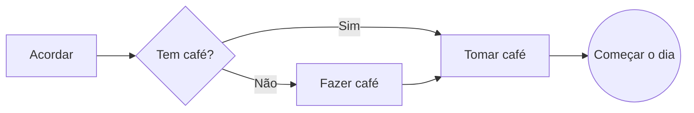
```mermaid
flowchart LR
    A[Acordar] --> B{Tem café?}
    B -->|Sim| C[Tomar café]
    B -->|Não| D[Fazer café]
    D --> C
    C --> E((Começar o dia))
```

------------

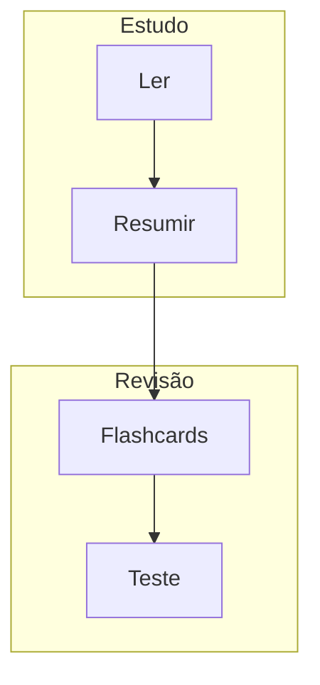
```mermaid
flowchart TD
    subgraph Estudo
        A[Ler] --> B[Resumir]
    end
    subgraph Revisão
        C[Flashcards] --> D[Teste]
    end
    B --> C
```

-----------------

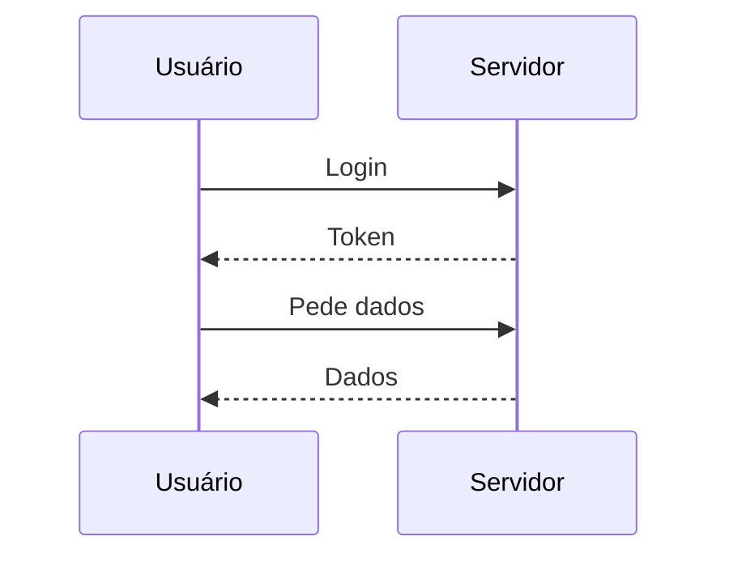
```mermaid
sequenceDiagram
    participant U as Usuário
    participant S as Servidor
    U->>S: Login
    S-->>U: Token
    U->>S: Pede dados
    S-->>U: Dados
```

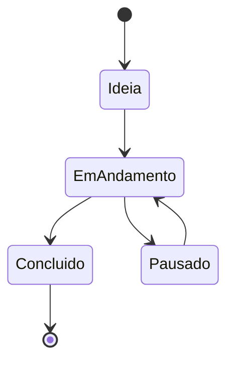
```mermaid
stateDiagram-v2
    [*] --> Ideia
    Ideia --> EmAndamento
    EmAndamento --> Concluido
    EmAndamento --> Pausado
    Pausado --> EmAndamento
    Concluido --> [*]
```

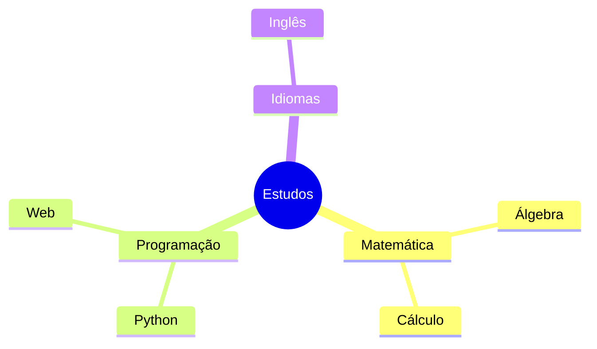
```mermaid
mindmap
  root((Estudos))
    Matemática
      Álgebra
      Cálculo
    Programação
      Python
      Web
    Idiomas
      Inglês
```

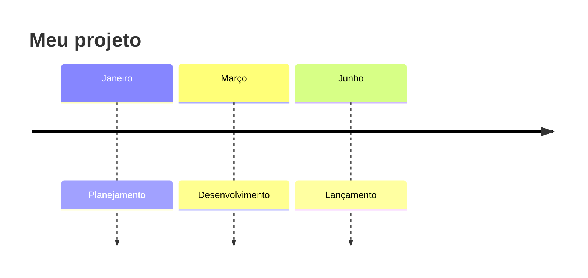
```mermaid
timeline
    title Meu projeto
    Janeiro : Planejamento
    Março : Desenvolvimento
    Junho : Lançamento
```

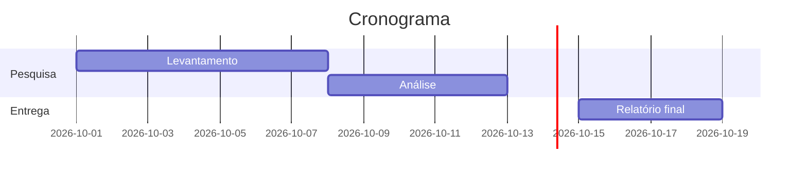
```mermaid
gantt
    title Cronograma
    dateFormat YYYY-MM-DD
    section Pesquisa
    Levantamento    :a1, 2026-10-01, 7d
    Análise         :after a1, 5d
    section Entrega
    Relatório final :2026-10-15, 4d
```

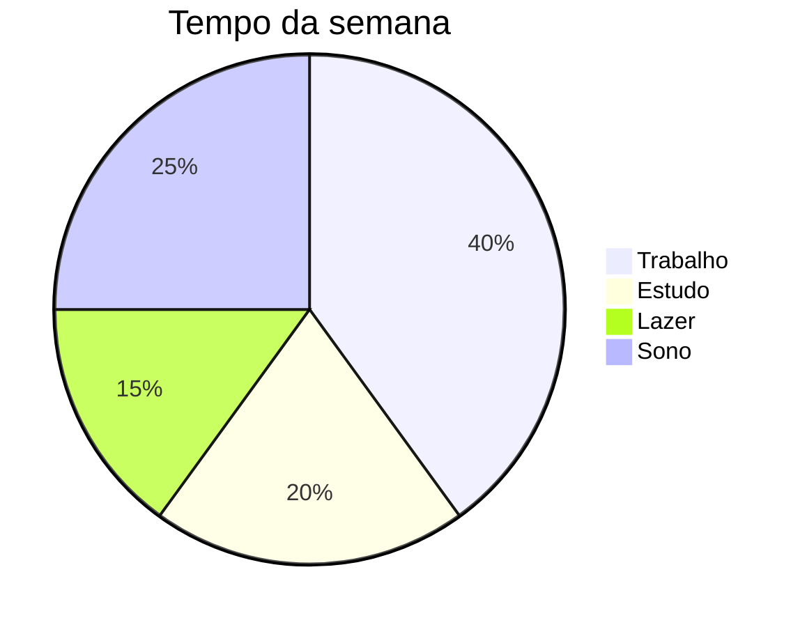
```mermaid
pie title Tempo da semana
    "Trabalho" : 40
    "Estudo" : 20
    "Lazer" : 15
    "Sono" : 25
```

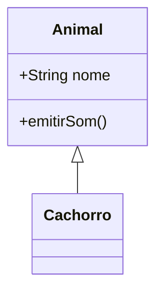
```mermaid
classDiagram
    class Animal {
        +String nome
        +emitirSom()
    }
    class Cachorro
    Animal <|-- Cachorro
```

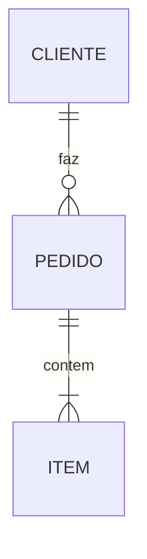
```mermaid
erDiagram
    CLIENTE ||--o{ PEDIDO : faz
    PEDIDO ||--|{ ITEM : contem
```

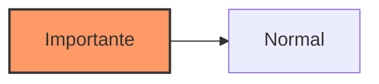
```mermaid
flowchart LR
    A[Importante] --> B[Normal]
    style A fill:#f96,stroke:#333,stroke-width:2px
```

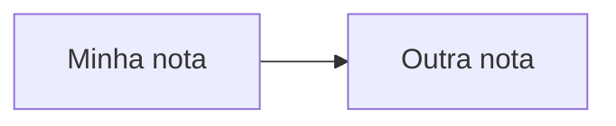
```mermaid
flowchart LR
    A[Minha nota] --> B[Outra nota]
    class A,B internal-link
```

